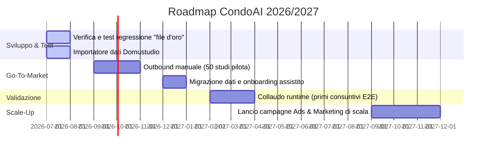

# CondoAI — Documento di Handoff e Allineamento Strategico

Questo documento funge da fonte di verità per allineare l'assistente AI (Claude) sullo stato tecnico del progetto, le scelte di posizionamento sul mercato, la strategia di pricing e la roadmap operativa.

---

## 1. Visione di Business & Strategia di Pricing

### Posizionamento Premium
CondoAI non si posiziona come un'alternativa economica ai gestionali tradizionali (es. Danea Domustudio), ma come uno strumento ad alto valore aggiunto che ottimizza drasticamente il tempo di lavoro dell'amministratore, agendo come un collaboratore virtuale. Il prezzo deve rispecchiare questo valore per segnalare solidità e affidabilità professionale.

### Modello di Listino (SaaS)
La metrica di tariffazione è basata sul **patrimonio gestito (Unità Immobiliari - U.I.)** e non sul numero di utenti dello studio. Questo elimina il punto debole più odiato di Danea (la tassa sulla crescita dei collaboratori) e si allinea alla prassi di Kipò.

*   **Postazioni/Collaboratori:** Illimitati in tutti i piani (il limite è dato solo dalle U.I. gestite).
*   **Inclusione AI:** L'assistenza AI è inclusa nativamente (con fair-use) e non venduta come add-on, in quanto rappresenta il motore principale del ROI del software.

| Piano | Limite U.I. | Prezzo Stimato / Mese | Prezzo / Anno (Fatt. Annuale) | Target / Note |
| :--- | :--- | :--- | :--- | :--- |
| **Starter** | Fino a 250 U.I. (~8 condomini) | **€69** | ~€830 | Piccoli studi in crescita o neo-costituiti. |
| **Professional** | Fino a 800 U.I. (~25 condomini) | **€179** | ~€2.150 | **Tier di riferimento (più venduto).** Soglia critica in cui si valuta un'assunzione. |
| **Studio** | Fino a 2.000 U.I. (~65 condomini) | **€379** | ~€4.550 | Studi strutturati con dipendenti. |
| **Enterprise** | Oltre 2.000 U.I. | *Su preventivo* | *Su preventivo* | Grandi gruppi di gestione o reti in consolidamento. |

### Tattica di Lancio
*   **Nessuno Sconto sul Canone:** Scontare il listino permanentemente distrugge il pricing power. La promozione per i "clienti fondatori" (primi 50 studi) deve basarsi sul regalare mesi di servizio (es. *"Prezzo bloccato 24 mesi + 3 mesi gratis + migrazione gratuita inclusa"*).
*   **La Barriera all'Entrata (Migrazione):** Lo storico contabile è il principale deterrente al cambio software. L'importazione automatica dei dati da Domustudio (anche via PDF/Excel elaborati dall'AI) deve essere gestita internamente dal team di CondoAI gratuitamente come costo di acquisizione cliente (CAC).

---

## 2. Scelte Strategiche: Feature da Escludere o Rinviare

Per mantenere il focus del team (due soci e un dev) sul core contabile ed evitare dispersioni, sono stati esclusi i seguenti segmenti e moduli adiacenti:

### A. No alla versione per "Condomini Autogestiti" (Senza Amministratore)
1.  **Limiti di Mercato:** L'art. 1129 c.c. rende l'amministratore obbligatorio sopra le 8 U.I. Il mercato dell'autogestione è confinato a micro-stabili con budget ridottissimo (prezzo massimo tollerabile ~50€/anno, es. Condomini-online).
2.  **Costo di Servizio Invertito:** Il condomino-volontario non ha competenze contabili/fiscali e genera un carico di ticket di assistenza 5-10x superiore rispetto a un professionista, erodendo i margini.
3.  **Conflitto di Canale:** Promuovere l'autogestione verrebbe percepito dai clienti paganti (amministratori professionisti) come un tentativo di sottrarre loro mandati, distruggendo la reputazione del brand nelle associazioni (ANACI, MAPI).
4.  **Trend Normativo:** Il DDL 1816/2026 spinge verso una progressiva professionalizzazione, puntando ad abolire le deroghe per amministratori interni privi di formazione.

### B. No alla Bacheca Condominiale "Social" (Annunci / Lavoro / Affitti)
1.  **Assenza di Liquidità:** Una bacheca all'interno di un condominio di 30 appartamenti è un silos isolato privo della massa critica necessaria per far incontrare domanda e offerta (gli utenti usano già Facebook Marketplace o Subito).
2.  **Responsabilità e Moderazione:** Genera un sovraccarico di lavoro per l'amministratore (che dovrebbe moderare liti o annunci inopportuni) e introduce rischi GDPR sulla condivisione dei dati personali tra condòmini.
3.  **La Versione Corretta:** L'unica bacheca prevista è l'**area riservata monodirezionale** (prevista anche dalle bozze del DDL 1816) in cui l'amministratore pubblica avvisi, verbali e l'estratto conto trimestrale, senza interazione o contenuti generati dai condòmini (Zero UGC).

### C. No a Provvigioni Opache sui Fornitori di Energia
1.  **Rischio Legale di Nullità della Nomina:** L'art. 1129 comma 14 c.c. e la giurisprudenza della Cassazione (Sent. 14424/2025) sanciscono la nullità della nomina dell'amministratore in caso di compensi o provvigioni indirette non dichiarate analiticamente all'atto dell'accettazione del mandato. Proporre provvigioni sulle forniture energetiche condominiali all'amministratore lo espone a gravi rischi di revoca giudiziale.
2.  **Alternative Pulite (Fase Successiva):**
    *   *Analisi Energetica:* Offrire un tool di benchmark energetico basato sulle fatture caricate ("Il tuo POD consuma il 22% in più della media") per dare autorevolezza all'amministratore in assemblea.
    *   *Modulo di Gara:* Un sistema trasparente per raccogliere e confrontare preventivi di diversi fornitori energetici con fee di listing dichiarate a carico del fornitore.
    *   *CER (Comunità Energetiche Rinnovabili):* Sviluppo di moduli per la gestione dei flussi energetici condivisi a livello condominiale (orizzonte 3 anni).

---

## 3. Roadmap Temporale & Calendario Contabile

La vendita di un gestionale contabile B2B è regolata rigidamente dalle scadenze dell'anno amministrativo. Nessun amministratore cambia software a metà esercizio o durante la stagione delle assemblee.

### Fasi Operative
1.  **Luglio - Agosto 2026 (Focus di Sviluppo):** Periodo di stasi del settore. Il focus deve essere al 100% sulla robustezza del motore di calcolo contabile e sull'importazione dati.
    *   *Test di Regressione "File d'Oro":* Importazione di almeno 3 condomini reali da Domustudio. I consuntivi e i riparti generati da CondoAI devono coincidere al centesimo con quelli storici approvati dello studio.
2.  **Settembre - Novembre 2026 (Finestra Commerciale):** Apertura del marketing. Non tramite investimenti pubblicitari massivi (Ads a freddo costose, CPC €2-5), ma tramite **outbound manuale** mirato su 50 studi pilota ad alta densità (es. asse Como-Milano) e sfruttando Amministrazione Gemelli come design partner principale.
3.  **Dicembre 2026 - Gennaio 2027 (Finestra di Migrazione):** Onboarding e migrazione fisica dei dati dei primi clienti contrattualizzati in vista dell'apertura del nuovo esercizio contabile.
4.  **Febbraio - Aprile 2027 (Validazione su Strada):** Collaudo del software sotto stress con l'invio delle CU (scadenza 16 marzo) e la tenuta delle prime assemblee basate sui rendiconti di CondoAI.

---

## 4. Stato della Codebase & Convenzioni Tecniche

### Stack Tecnologico
*   **Frontend:** React 18 + Vite 8 + CSS Vanilla (Sora Font, layout responsive con preferenza Dark Mode salvata in `localStorage` con fallback per tema chiaro dinamico).
*   **Backend:** Supabase (PostgreSQL, RLS, Storage per documenti ed estratti conto, Edge Functions).
*   **Integrazioni:** Stripe (gestione abbonamenti e referral con sconti automatici su checkout), Resend (invio email di sollecito rate e richieste anagrafiche).
*   **Modelli AI:** `gemini-pro-latest` per compiti complessi (analisi verbali, scelta criteri) e `gemini-flash-latest` per estrazioni rapide (OCR fatture, estratti conto, anagrafe), gestiti tramite la Edge Function `claude-proxy` che ne mappa le risposte mantenendo intatto l'uso di `callClaude`.

### Struttura File Chiave
*   `src/components/ConsuntivoTab.jsx` e `src/hooks/useConsuntivo.js`: Generazione e rendering delle sezioni A→E del consuntivo.
*   `src/lib/exportConsuntivo.js`: Esportazione in PDF del rendiconto annuale con loghi di studio.
*   `src/components/AnagraficaCondominioTab.jsx`: Tab unificato per la gestione catastale/anagrafica del condominio con supporto all'importazione OCR AI da moduli di autocertificazione.
*   `src/components/PreventivoSection.jsx`: Tab unificato per preventivo di spesa e inserimento saldi iniziali/fondi cassa.
*   `src/pages/RiconciliazioniPage.jsx` e `RiconciliazioniIncassiPage.jsx`: Flussi di riconciliazione estratti conto bancari.
*   `src/pages/ImpostazioniPage.jsx`: Configurazione del profilo amministratore, branding, notifiche e collaboratori.

### Convenzioni DB e RLS
*   Tutti i controlli sui dati sono deterministici. L'AI propone, l'amministratore conferma.
*   **Helper RLS:** Tutte le query su tabelle sensibili devono essere protette da RLS basate su `amministratore_id` tramite la funzione PostgreSQL `user_owns_condominio(condominio_id)`.
*   I collaboratori ereditano i limiti del piano dell'amministratore titolare del servizio e vedono solo i condomini a loro esplicitamente associati tramite la tabella `collaboratori_condomini`.

---

## 5. Monetizzazione FinTech, Hub SDI & Accordi di Partnership

### A. Integrazione Hub SDI & Abbattimento Costi AI
* **Provider:** Aruba Business / Namirial (Codice Destinatario 7 cifre `KRRH6B9` / canale dedicato).
* **Conservazione Digitale:** AgID decennale inclusa tramite DocFly/Partner con manleva totale.
* **Pricing:** Incluso nativamente nel canone SaaS. Il parsing algoritmico a costo zero degli XML abbatte i costi di inferenza AI dell'80%.

### B. Open Banking (PSD2) & Accordi Bancari
* **Tecnologia:** Gateway Open Banking (Fabrick / CBI Globe) per sincronizzazione notturna estratti conto e pagamenti PISP 1-Click.
* **Monetizzazione:** Bounty/Referral fee da 50€ a 150€ per nuovo conto corrente condominiale aperto + accordi annuali di co-marketing/esclusiva con grandi istituti (Intesa Sanpaolo / UniCredit).

### C. Embedded Marketplace & Sponsor Network
* Monetizzazione ad alto margine su canoni annuali di presenza esclusiva e lead generation per fornitori certificati (Assicurazioni fabbricato, Energia/Gas parti comuni, Ascensori).
* Contratti annuali a 12 mesi con canoni a scaglioni di crescita (legati al numero di condomini attivi).

### D. Accordo Strategico Studio Gemelli (Term Sheet 5% - 10k€)
* **Investimento:** € 10.000,00 + IVA una tantum per Licenza Founder a vita + Opzione/Diritto di partecipazione al 5% nella NewCo CondoFast (95% in capo a M Project SRL).
* **Provvigioni Referral:** 50 € / 100 € / 150 € all'anno per cliente attivo portato, fino all'efficacia dell'ingresso societario.

